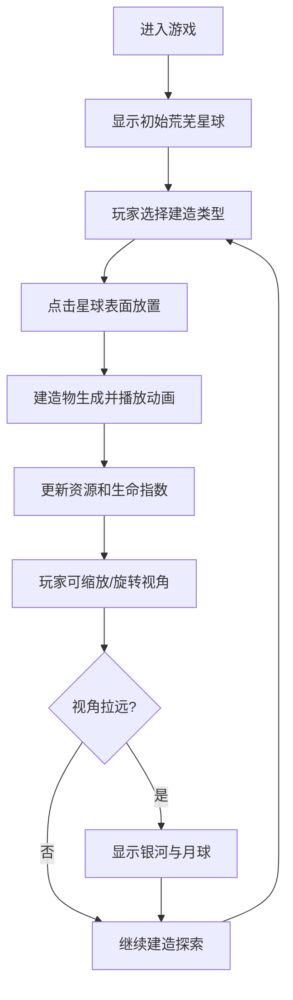

## 1. 产品概述

星球重生模拟器是一款沉浸式3D星球建造游戏，玩家从一颗荒芜的星球开始，通过建造森林、冰川、城市和草地等生态系统，逐步将星球改造成生机勃勃的家园。游戏拥有细腻的视觉表现，远景可欣赏壮丽银河与月球。

- 核心目标：让玩家体验从无到有打造星球的成就感，通过精美的3D画面提供沉浸式建造乐趣
- 目标用户：休闲游戏爱好者、模拟建造类游戏玩家、太空主题爱好者

## 2. 核心功能

### 2.1 用户角色

| 角色 | 注册方式 | 核心权限 |
|------|----------|----------|
| 玩家 | 无需注册，直接进入游戏 | 建造各种地形、管理资源、自由探索星球 |

### 2.2 功能模块

1. **主游戏界面**：3D星球场景、建造控制面板、资源状态栏
2. **建造系统**：森林、冰川、城市、草地四种建造类型
3. **相机系统**：可拉近拉远、旋转环绕，远景呈现银河月球
4. **粒子特效**：星光、大气层、云流动等细腻效果

### 2.3 页面详情

| 页面名称 | 模块名称 | 功能描述 |
|----------|----------|----------|
| 游戏主界面 | 3D星球场景 | 可交互的3D星球，支持鼠标拖拽旋转、滚轮缩放 |
| 游戏主界面 | 建造面板 | 底部建造选项栏，选择建造类型后点击星球放置 |
| 游戏主界面 | 资源状态栏 | 显示当前已建造数量、星球生命指数等数据 |
| 游戏主界面 | 远景系统 | 拉远相机时显示银河背景和环绕的月球 |

## 3. 核心流程

玩家进入游戏后，首先看到一颗荒芜的星球。通过底部建造面板选择建造类型，然后点击星球表面放置建筑物。随着建造数量增加，星球变得越来越繁荣。玩家可以自由旋转和缩放视角，拉远时可以欣赏银河和月球的壮丽景象。

## 4. 用户界面设计

### 4.1 设计风格

- **主色调**：深邃宇宙蓝（#0a0e27）、生命绿（#2d5a27）、冰川蓝（#87ceeb）、城市暖黄（#ffa500）
- **整体风格**：科幻沉浸式、细腻精致、宇宙太空主题
- **按钮风格**：半透明玻璃态、圆角设计、悬停发光效果
- **字体**：使用 Orbitron 作为数字和标题字体，Noto Sans SC 作为正文字体
- **布局风格**：建造面板底部悬浮，资源状态顶部悬浮，3D场景全屏展示
- **图标风格**：简约线性图标，配合发光效果

### 4.2 页面设计概述

| 页面名称 | 模块名称 | UI元素 |
|----------|----------|--------|
| 游戏主界面 | 3D场景 | 星球、大气辉光、云层动画、银河背景、月球、星光粒子 |
| 游戏主界面 | 建造面板 | 四个建造按钮（森林、冰川、城市、草地）、选中高亮效果 |
| 游戏主界面 | 状态栏 | 生命指数进度条、各类建筑计数、星球名称 |
| 游戏主界面 | 操作提示 | 鼠标拖拽旋转、滚轮缩放的提示文字 |

### 4.3 响应式设计

- 桌面端优先，支持全屏游戏体验
- 自适应不同屏幕尺寸，建造面板保持在底部适中位置
- 移动端适配触屏操作（双指缩放、单指旋转）

### 4.4 3D场景指南

- **环境与氛围**：深邃宇宙背景，银河系星带，成千上万颗星星点缀，营造浩瀚太空感
- **光照设置**：主光源模拟太阳光，暖色平行光；大气散射光营造星球边缘辉光；环境光提供基础照明
- **相机设置**：透视相机，支持轨道控制，距离范围从近距离（看地表细节）到远距离（看银河全貌）
- **构图与焦点**：星球位于画面中心，月球在轨道上环绕，银河在远景作为背景
- **交互与动画**：星球缓慢自转，云层流动，星光闪烁，建造物生成时有缩放动画
- **后期特效**：泛光效果、轻微晕影、颜色校正，提升画面质感
- **性能预算**：保持60fps，使用实例化渲染优化大量建造物
