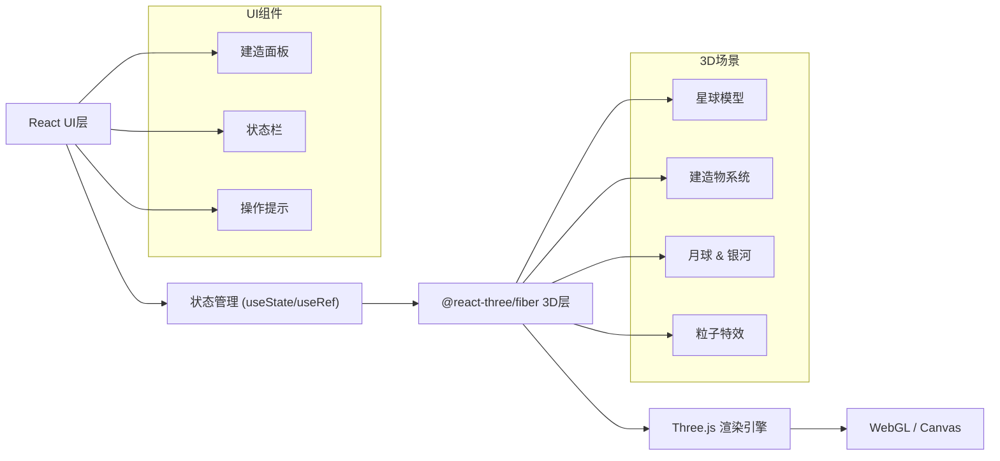

## 1. 架构设计

本项目为纯前端3D游戏应用，采用React作为UI框架，Three.js（通过@react-three/fiber）作为3D渲染引擎，无需后端服务。



## 2. 技术描述

- **前端框架**：React@18 + TypeScript
- **构建工具**：Vite@5
- **3D引擎**：Three.js + @react-three/fiber + @react-three/drei + @react-three/postprocessing
- **样式方案**：TailwindCSS@3
- **状态管理**：React useState/useRef/useContext（轻量场景）
- **无后端**：纯前端游戏，数据保存在内存中

## 3. 路由定义

| 路由 | 用途 |
|------|------|
| / | 游戏主界面（唯一页面） |

## 4. 项目结构

```
src/
├── components/
│   ├── GameCanvas.tsx      # 3D画布主组件
│   ├── Planet.tsx          # 星球组件
│   ├── Moon.tsx            # 月球组件
│   ├── Starfield.tsx       # 星空银河背景
│   ├── Buildings/          # 建造物组件
│   │   ├── Forest.tsx
│   │   ├── Glacier.tsx
│   │   ├── City.tsx
│   │   └── Grassland.tsx
│   └── UI/
│       ├── BuildPanel.tsx  # 底部建造面板
│       ├── StatusBar.tsx   # 顶部状态栏
│       └── HintText.tsx    # 操作提示
├── hooks/
│   └── useGameState.ts     # 游戏状态管理
├── types/
│   └── game.ts             # 类型定义
├── utils/
│   └── helpers.ts          # 工具函数
├── App.tsx
├── main.tsx
└── index.css
```

## 5. 核心技术点

### 5.1 3D渲染
- 使用 @react-three/fiber 声明式编写Three.js场景
- 使用 @react-three/drei 提供的 OrbitControls、Stars 等辅助组件
- 使用 @react-three/postprocessing 添加 Bloom 等后期效果

### 5.2 建造系统
- 射线检测（Raycaster）实现点击星球表面放置建造物
- 使用实例化网格（InstancedMesh）优化大量建造物性能
- 球面坐标转换，确保建造物正确贴合星球表面

### 5.3 视觉效果
- 自定义Shader实现大气层辉光效果
- 云层动画使用纹理偏移实现
- 星光粒子系统营造宇宙氛围
- 月球公转动画

### 5.4 交互设计
- OrbitControls 实现相机旋转/缩放/平移
- 鼠标悬停反馈
- 建造物放置动画（缩放+淡入）
